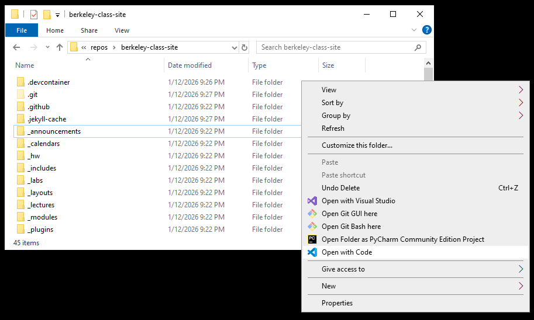
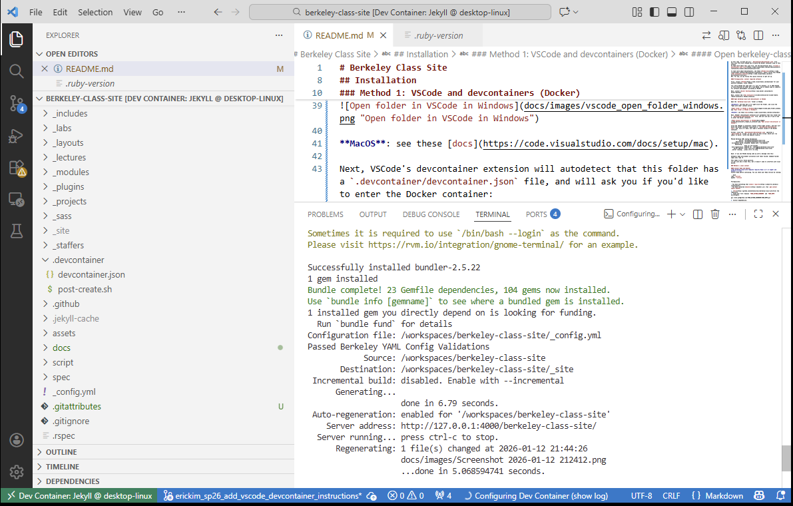

# Berkeley Class Site

[](https://github.com/berkeley-cdss/berkeley-class-site/actions/workflows/jekyll.yml) •
[](https://github.com/berkeley-cdss/berkeley-class-site/actions/workflows/rspec.yml)

A template for UC Berkeley class websites (with a focus on EECS/CS/DS courses).

## Installation

To get started on development, please setup your environment using one of two methods.

### Method 1: VSCode and devcontainers (Docker)

In this setup, we will use Visual Studio Code's ("VSCode") "devcontainers" feature to setup and install required project dependencies.

In short, "devcontainers" is a VSCode extension that enables convenient integration between VSCode and Docker.

In this repo, we have set up a `.devcontainer/devcontainer.json` file.
This json file tells VSCode how to build the Docker container used in this project.
To learn more about this json file, see the devcontainer docs: ["Create a devcontainer.json file"](https://code.visualstudio.com/docs/devcontainers/containers#_create-a-devcontainerjson-file)

To learn more about devcontainers, see these [VSCode docs](https://code.visualstudio.com/docs/devcontainers/containers), and/or follow this VSCode ["Dev Containers tutorial](https://code.visualstudio.com/docs/devcontainers/tutorial).
But, for now, we can follow this quick tutorial to get set up.

#### Prerequisites: install required software

First, install [VSCode](https://code.visualstudio.com/download) for your platform (Windows, Linux, MacOS).

Tip: while VSCode may seem that it's only for Windows, as of 2026 VSCode is very effective on other OS's like MacOS, and is widely used in industry for software development (including on MacOS).

Next, install [Docker Desktop](https://www.docker.com/products/docker-desktop).

Next, install the ["Dev Containers"](vscode:extension/ms-vscode-remote.remote-containers) VSCode extension.

#### Open berkeley-class-site devcontainer in VSCode

After cloning the repository (or your fork of it), open the `berkeley-class-site` folder in VSCode.

**Windows**: one easy way is to right-click the folder, and click the "Open with Code" context action.



**MacOS**: see these [docs](https://code.visualstudio.com/docs/setup/mac).

Next, VSCode's devcontainer extension will autodetect that this folder has a `.devcontainer/devcontainer.json` file, and will ask you if you'd like to enter the Docker container:


Click the "Reopen in Container" button (lower-right corner), and this will build the Docker container (specified in `.devcontainer/devcontainer.json`) and, once it's done, will open a terminal inside of the Docker container.

Further: since the `.devcontainer/devcontainer.json` specifies a `post-create.sh` script, it will also run this script, which will run jekyll to build + serve the website locally:



From here, you can make changes to the website, and `jekyll` will autodetect changes and regenerate the site. Unless you change `_config.yml`, you do not need to restart the `jekyll` server.

Note: if you see VSCode dialog come up with a message like this:
```
Automatic Ruby environment activation with rbenv failed: Command failed: rbenv exec ruby -E
```
This seems to be a false positive.
I'm not sure why it does this, but it doesn't seem to interfere with local builds.

**Important**: for now, if you exit VSCode, reopen VSCode at a later time, and re-enter the devcontainer, VScode will open up a terminal within the devcontainer **without running .devcontainer/post-create.sh**.
This means that (among other things) `jekyll` is not set up correctly.
The workaround is to run `./.devcontainer/post-create.sh` from the terminal, which will begin locally serving the website via `jekyll` as expected.

TODO: we should modify the devcontainer setup (eg devcontainer.json, post-create.sh) to improve dev QoL.

### Method 2: Local install

Rather than using Docker containers (and VSCode's devcontainer extension), instead we will install our project dependencies "locally".

#### Install Ruby and Bundler
**The berkeley-class-site template requires Ruby 3.3.9 or higher and bundler >= 2.6**
Install Ruby before continuing. You can check your Ruby version by running:

```bash
ruby --version
bundle --version
```

Prerequisites:

- You have everything that [Jekyll requires](https://jekyllrb.com/docs/installation/)
- You have installed [Bundler](https://bundler.io/): Run `gem install jekyll bundler`

1. [Fork](https://github.com/berkeley-eecs/berkeley-class-site/fork) the repository.
2. Clone your fork (replace `YOUR_GITHUB_USERNAME` and `YOUR_REPO` accordingly).
```
git clone git@github.com:YOUR_GITHUB_USERNAME/YOUR_REPO.git
```
3. Install dependencies:

```
cd YOUR_REPO
bundle install
```

## Usage

To run the site locally, run:

```
bundle exec jekyll serve
```

Note that if you alter `_config.yml`, you will need to rerun the above command to see the changes reflected.

Search throughout the repository for TODO items called `TODO(setup)` and complete them to customize the site for your course. We recommend deleting the `docs/` directory for a semesterly course website. `docs/` contains developer docs and is visible on the [deployed template website](https://berkeley-cdss.github.io/berkeley-class-site/).

## Deployment

The easiest way to deploy your site is with [GitHub Pages](https://docs.github.com/en/pages/setting-up-a-github-pages-site-with-jekyll/about-github-pages-and-jekyll) and the `.github/workflows/jekyll.yml` workflow included in this template.s

## Contributing

See [CONTRIBUTING.md](CONTRIBUTING.md) for instructions on how to develop this template as part of your role on course staff or if you're otherwise interested in contributing to this template repository.

## License

[MIT](LICENSE)
