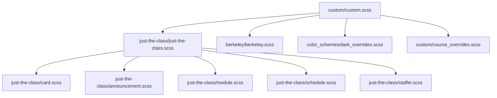
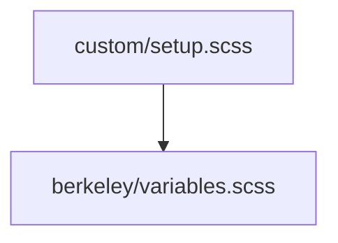
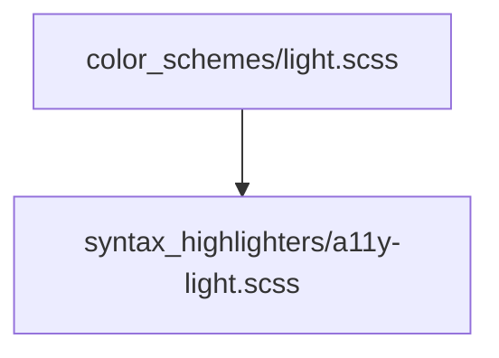
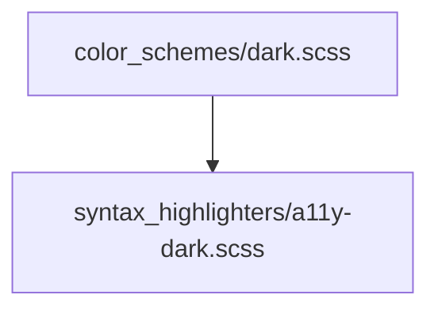

# Sass

Here is how the imports work in the `_sass` directory. 

```mermaid
graph TD;
    custom/custom.scss-->just-the-class/just-the-class.scss;
    custom/custom.scss-->berkeley/berkeley.scss;
    custom/custom.scss-->color_schemes/dark_overrides.scss;
    custom/custom.scss-->custom/course_overrides.scss;
    just-the-class/just-the-class.scss-->just-the-class/card.scss;
    just-the-class/just-the-class.scss-->just-the-class/announcement.scss;
    just-the-class/just-the-class.scss-->just-the-class/module.scss;
    just-the-class/just-the-class.scss-->just-the-class/schedule.scss;
    just-the-class/just-the-class.scss-->just-the-class/staffer.scss;
```

```mermaid
graph TD;
    custom/setup.scss-->berkeley/variables.scss;
```

```mermaid
graph TD;
    color_schemes/light.scss-->syntax_highlighters/a11y-light.scss;
```

```mermaid
graph TD;
    color_schemes/dark.scss-->syntax_highlighters/a11y-dark.scss;
```